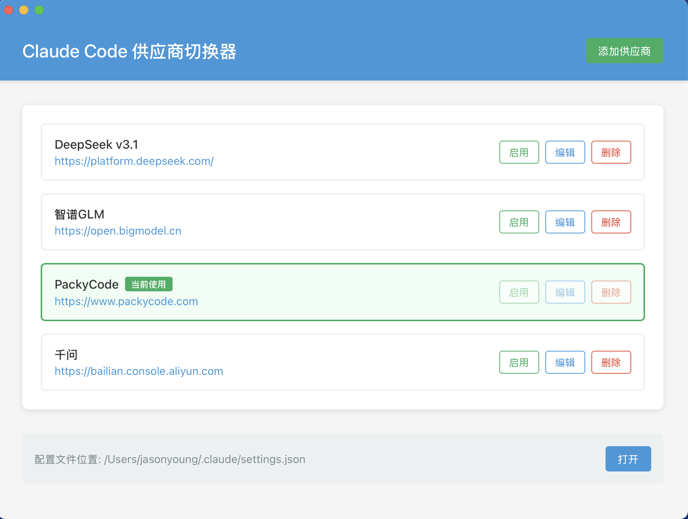
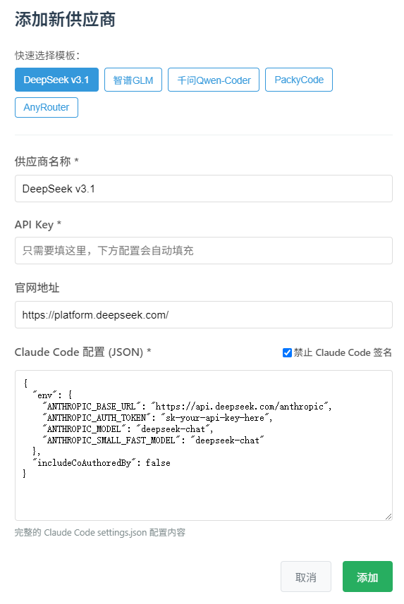

# Claude Code & Codex 供应商切换器

[](https://github.com/farion1231/cc-switch/releases)
[](https://github.com/farion1231/cc-switch/releases)
[](https://tauri.app/)

一个用于管理和切换 Claude Code 与 Codex 不同供应商配置的桌面应用。

> v3.3.0 ：VS Code Codex 插件一键配置/移除（默认自动同步）、Codex 通用配置片段与自定义向导增强、WSL 环境支持、跨平台托盘与 UI 优化。

> v3.2.0 ：全新 UI、macOS系统托盘、内置更新器、原子写入与回滚、改进暗色样式、单一事实源（SSOT）与一次性迁移/归档。

> v3.1.0 ：新增 Codex 供应商管理与一键切换，支持导入当前 Codex 配置为默认供应商，并在内部配置从 v1 → v2 迁移前自动备份（详见下文“迁移与归档”）。

> v3.0.0 重大更新：从 Electron 完全迁移到 Tauri 2.0，应用体积显著降低、启动性能大幅提升。

## 功能特性（v3.3.0）

- **VS Code Codex 插件一键配置**：供应商卡片支持「应用到 VS Code / 从 VS Code 移除」，默认开启自动同步，并可跨 Code / Insiders / VSCodium 写入 `settings.json`
- **通用配置片段**：Claude 与 Codex 共用 JSON/TOML 片段，提供编辑器 lint、内容校验、统一错误提示与本地持久化
- **Codex 配置向导**：新增显示名称、专用 API Key URL、HTML5 校验与预设模板，方便快速配置第三方服务
- **系统托盘与快捷操作**：窗口隐藏时仍可通过托盘切换供应商，并在自动同步开启时触发 VS Code 写入
- **平台适配**：新增 Windows WSL 环境支持、Linux 自动禁用模态背景模糊解决白屏问题、macOS Dock 点击即可恢复窗口
- **UI优化**：多处 UI 和使用体验优化

## 界面预览

### 主界面



### 添加供应商



## 下载安装

### 系统要求

- **Windows**: Windows 10 及以上
- **macOS**: macOS 10.15 (Catalina) 及以上
- **Linux**: Ubuntu 20.04+ / Debian 11+ / Fedora 34+ 等主流发行版

### Windows 用户

从 [Releases](../../releases) 页面下载最新版本的 `CC-Switch-Setup.msi` 安装包或者 `CC-Switch-Windows-Portable.zip` 绿色版。

### macOS 用户

从 [Releases](../../releases) 页面下载 `CC-Switch-macOS.zip` 解压使用。

> **注意**：由于作者没有苹果开发者账号，首次打开可能出现"未知开发者"警告，请先关闭，然后前往"系统设置" → "隐私与安全性" → 点击"仍要打开"，之后便可以正常打开

### Linux 用户

从 [Releases](../../releases) 页面下载最新版本的 `.deb` 包或者 `AppImage`安装包。

## 使用说明

1. 点击"添加供应商"添加你的 API 配置
2. 切换方式：
   - 在主界面选择供应商后点击切换
   - 或通过“系统托盘（菜单栏）”直接选择目标供应商，立即生效
3. 切换会写入对应应用的“live 配置文件”（Claude：`settings.json`；Codex：`auth.json` + `config.toml`）
4. 重启或新开终端以确保生效
5. 若需切回官方登录，在预设中选择“官方登录”并切换即可；重启终端后按官方流程登录

### 检查更新

- 在“设置”中点击“检查更新”，若内置 Updater 配置可用将直接检测与下载；否则会回退打开 Releases 页面

### Codex 说明（SSOT）

- 配置目录：`~/.codex/`
  - live 主配置：`auth.json`（必需）、`config.toml`（可为空）
- API Key 字段：`auth.json` 中使用 `OPENAI_API_KEY`
- 切换行为（不再写“副本文件”）：
  - 供应商配置统一保存在 `~/.cc-switch/config.json`
  - 切换时将目标供应商写回 live 文件（`auth.json` + `config.toml`）
  - 采用“原子写入 + 失败回滚”，避免半写状态；`config.toml` 可为空
- 导入默认：当该应用无任何供应商时，从现有 live 主配置创建一条默认项并设为当前
- 官方登录：可切换到预设“Codex 官方登录”，重启终端后按官方流程登录

### Claude Code 说明（SSOT）

- 配置目录：`~/.claude/`
  - live 主配置：`settings.json`（优先）或历史兼容 `claude.json`
- API Key 字段：`env.ANTHROPIC_AUTH_TOKEN`
- 切换行为（不再写“副本文件”）：
  - 供应商配置统一保存在 `~/.cc-switch/config.json`
  - 切换时将目标供应商 JSON 直接写入 live 文件（优先 `settings.json`）
  - 编辑当前供应商时，先写 live 成功，再更新应用主配置，保证一致性
- 导入默认：当该应用无任何供应商时，从现有 live 主配置创建一条默认项并设为当前
- 官方登录：可切换到预设“Claude 官方登录”，重启终端后可使用 `/login` 完成登录

### 迁移与归档（自 v3.2.0 起）

- 一次性迁移：首次启动 3.2.0 及以上版本会扫描旧的“副本文件”并合并到 `~/.cc-switch/config.json`
  - Claude：`~/.claude/settings-*.json`（排除 `settings.json` / 历史 `claude.json`）
  - Codex：`~/.codex/auth-*.json` 与 `config-*.toml`（按名称成对合并）
- 去重与当前项：按“名称（忽略大小写）+ API Key”去重；若当前为空，将 live 合并项设为当前
- 归档与清理：
  - 归档目录：`~/.cc-switch/archive/<timestamp>/<category>/...`
  - 归档成功后删除原副本；失败则保留原文件（保守策略）
- v1 → v2 结构升级：会额外生成 `~/.cc-switch/config.v1.backup.<timestamp>.json` 以便回滚
- 注意：迁移后不再持续归档日常切换/编辑操作，如需长期审计请自备备份方案

## 开发

### 环境要求

- Node.js 18+
- pnpm 8+
- Rust 1.75+
- Tauri CLI 2.0+

### 开发命令

```bash
# 安装依赖
pnpm install

# 开发模式（热重载）
pnpm dev

# 类型检查
pnpm typecheck

# 代码格式化
pnpm format

# 检查代码格式
pnpm format:check

# 构建应用
pnpm build

# 构建调试版本
pnpm tauri build --debug
```

### Rust 后端开发

```bash
cd src-tauri

# 格式化 Rust 代码
cargo fmt

# 运行 clippy 检查
cargo clippy

# 运行测试
cargo test
```

## 技术栈

- **[Tauri 2](https://tauri.app/)** - 跨平台桌面应用框架（集成 updater/process/opener/log/tray-icon）
- **[React 18](https://react.dev/)** - 用户界面库
- **[TypeScript](https://www.typescriptlang.org/)** - 类型安全的 JavaScript
- **[Vite](https://vitejs.dev/)** - 极速的前端构建工具
- **[Rust](https://www.rust-lang.org/)** - 系统级编程语言（后端）

## 项目结构

```
├── src/                   # 前端代码 (React + TypeScript)
│   ├── components/       # React 组件
│   ├── config/          # 预设供应商配置
│   ├── lib/             # Tauri API 封装
│   └── utils/           # 工具函数
├── src-tauri/            # 后端代码 (Rust)
│   ├── src/             # Rust 源代码
│   │   ├── commands.rs  # Tauri 命令定义
│   │   ├── config.rs    # 配置文件管理
│   │   ├── provider.rs  # 供应商管理逻辑
│   │   └── store.rs     # 状态管理
│   ├── capabilities/    # 权限配置
│   └── icons/           # 应用图标资源
└── screenshots/          # 界面截图
```

## 更新日志

查看 [CHANGELOG.md](CHANGELOG.md) 了解版本更新详情。

## Electron 旧版

[Releases](../../releases) 里保留 v2.0.3 Electron 旧版

如果需要旧版 Electron 代码，可以拉取 electron-legacy 分支

## 贡献

欢迎提交 Issue 和 Pull Request！

## Star History

[](https://www.star-history.com/#farion1231/cc-switch&Date)

## License

MIT © Jason Young
