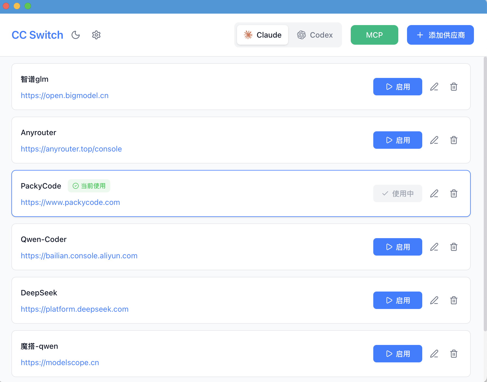

# Claude Code & Codex 供应商切换器

[](https://github.com/jasonyoung/cc-switch/releases)
[](https://github.com/jasonyoung/cc-switch/releases)
[](https://tauri.app/)

一个用于管理和切换 Claude Code 与 Codex 不同供应商配置的桌面应用。

> v3.1.0 ：新增 Codex 供应商管理与一键切换，支持导入当前 Codex 配置为默认供应商，并在内部配置从 v1 → v2 迁移前自动备份（详见下文““迁移与备份”）。

> v3.0.0 重大更新：从 Electron 完全迁移到 Tauri 2.0，应用体积减少 85%（从 ~80MB 降至 ~12MB），启动速度提升 10 倍！

## 功能特性

- **极速启动** - 基于 Tauri 2.0，原生性能，秒开应用
- 一键切换不同供应商
- 同时支持 Claude Code 与 Codex 的供应商切换与导入
- Qwen coder、kimi k2、智谱 GLM、DeepSeek v3.1、packycode 等预设供应商只需要填写 key 即可一键配置
- 支持添加自定义供应商
- 随时切换官方登录
- 简洁美观的图形界面
- 信息存储在本地 ~/.cc-switch/config.json，无隐私风险
- 超小体积 - 仅 ~5MB 安装包

## 界面预览

### 主界面



### 添加供应商


## 下载安装

### 系统要求

- **Windows**: Windows 10 及以上
- **macOS**: macOS 10.15 (Catalina) 及以上
- **Linux**: Ubuntu 20.04+ / Debian 11+ / Fedora 34+ 等主流发行版

### Windows 用户

从 [Releases](../../releases) 页面下载最新版本的 `CC-Switch-Setup.msi` 安装包或者 `CC-Switch-Windows-Portable.zip` 绿色版。

### macOS 用户

从 [Releases](../../releases) 页面下载 `CC-Switch-macOS.zip` 解压使用。

> **注意**：由于作者没有苹果开发者账号，首次打开可能出现"未知开发者"警告，请先关闭，然后前往"系统设置" → "隐私与安全性" → 点击"仍要打开"，之后便可以正常打开

### Linux 用户

从 [Releases](../../releases) 页面下载最新版本的 `.deb` 包。

## 使用说明

1. 点击"添加供应商"添加你的 API 配置
2. 选择要使用的供应商，点击单选按钮切换
3. 配置会自动保存到对应应用的配置文件中
4. 重启或者新打开终端以生效
5. 如果需要切回 Claude 官方登录，可以添加预设供应商里的“Claude 官方登录”并切换，重启终端后即可进行正常的 /login 登录

### Codex 说明

- 配置目录：`~/.codex/`
  - 主配置文件：`auth.json`（必需）、`config.toml`（可为空）
  - 供应商副本：`auth-<name>.json`、`config-<name>.toml`
- API Key 字段：`auth.json` 中使用 `OPENAI_API_KEY`
- 切换策略：将选中供应商的副本覆盖到主配置（`auth.json`、`config.toml`）。若供应商没有 `config-*.toml`，会创建空的 `config.toml`。
- 导入默认：若 `~/.codex/auth.json` 存在，会将当前主配置导入为 `current` 供应商；`config.toml` 不存在时按空处理。
- 官方登录：可切换到预设“Codex 官方登录”，重启终端后可选择使用 ChatGPT 账号完成登录。

### Claude Code 说明

- 配置目录：`~/.claude/`
  - 主配置文件：`settings.json`（推荐）或 `claude.json`（旧版兼容，若存在则继续使用）
  - 供应商副本：`settings-<name>.json`
- API Key 字段：`env.ANTHROPIC_AUTH_TOKEN`
- 切换策略：将选中供应商的副本覆盖到主配置（`settings.json`/`claude.json`）。如当前有配置且存在“当前供应商”，会先将主配置备份回该供应商的副本文件。
- 导入默认：若 `~/.claude/settings.json` 或 `~/.claude/claude.json` 存在，会将当前主配置导入为 `current` 供应商副本。
- 官方登录：可切换到预设“Claude 官方登录”，重启终端后可使用 `/login` 完成登录。

### 迁移与备份

- cc-switch 自身配置从 v1 → v2 迁移时，将在 `~/.cc-switch/` 目录自动创建时间戳备份：`config.v1.backup.<timestamp>.json`。
- 实际生效的应用配置文件（如 `~/.claude/settings.json`、`~/.codex/auth.json`/`config.toml`）不会被修改，切换仅在用户点击“切换”时按副本覆盖到主配置。

## 开发

### 环境要求

- Node.js 18+
- pnpm 8+
- Rust 1.75+
- Tauri CLI 2.0+

### 开发命令

```bash
# 安装依赖
pnpm install

# 开发模式（热重载）
pnpm dev

# 类型检查
pnpm typecheck

# 代码格式化
pnpm format

# 检查代码格式
pnpm format:check

# 构建应用
pnpm build

# 构建调试版本
pnpm tauri build --debug
```

### Rust 后端开发

```bash
cd src-tauri

# 格式化 Rust 代码
cargo fmt

# 运行 clippy 检查
cargo clippy

# 运行测试
cargo test
```

## 技术栈

- **[Tauri 2.0](https://tauri.app/)** - 跨平台桌面应用框架
- **[React 18](https://react.dev/)** - 用户界面库
- **[TypeScript](https://www.typescriptlang.org/)** - 类型安全的 JavaScript
- **[Vite](https://vitejs.dev/)** - 极速的前端构建工具
- **[Rust](https://www.rust-lang.org/)** - 系统级编程语言（后端）

## 项目结构

```
├── src/                   # 前端代码 (React + TypeScript)
│   ├── components/       # React 组件
│   ├── config/          # 预设供应商配置
│   ├── lib/             # Tauri API 封装
│   └── utils/           # 工具函数
├── src-tauri/            # 后端代码 (Rust)
│   ├── src/             # Rust 源代码
│   │   ├── commands.rs  # Tauri 命令定义
│   │   ├── config.rs    # 配置文件管理
│   │   ├── provider.rs  # 供应商管理逻辑
│   │   └── store.rs     # 状态管理
│   ├── capabilities/    # 权限配置
│   └── icons/           # 应用图标资源
└── screenshots/          # 界面截图
```

## 更新日志

查看 [CHANGELOG.md](CHANGELOG.md) 了解版本更新详情。

## Electron 旧版

[Releases](../../releases) 里保留 v2.0.3 Electron 旧版

如果需要旧版 Electron 代码，可以拉取 electron-legacy 分支

## 贡献

欢迎提交 Issue 和 Pull Request！

## License

MIT © Jason Young
