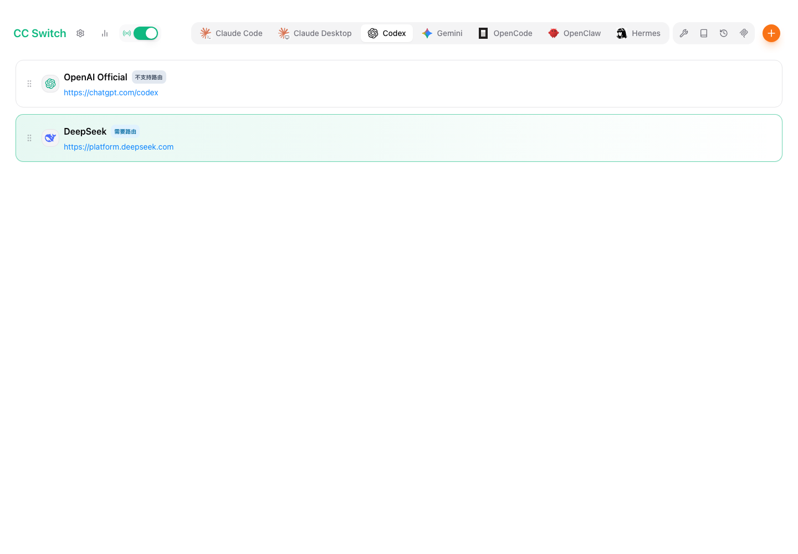
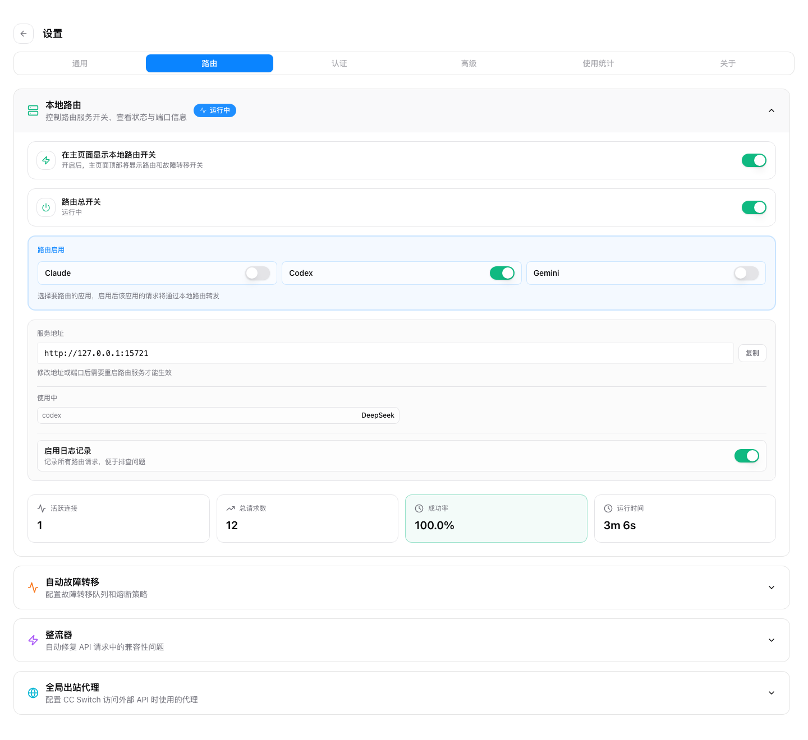

# 在 Codex 中用 DeepSeek 这类 Chat 格式 API：CC Switch 本地路由攻略

> 适用版本：CC Switch 3.16.0 及附近版本。本文根据仓库内文档与代码整理，并用 DeepSeek 作为 OpenAI Chat Completions 兼容接口的示例。截图来自当前前端界面，使用去敏示例数据生成，避免泄露真实 API Key 或账户余额。

## 为什么需要本地路由

新版 Codex CLI 面向的是 OpenAI Responses API，而 DeepSeek、Kimi、MiniMax、SiliconFlow 等很多供应商实际暴露的是 OpenAI Chat Completions 形态，也就是 `/chat/completions`。这两种协议的请求体、流式事件和返回结构不同，直接把 Chat 接口填进 Codex 配置里，常见结果就是模型列表不对、请求 404/400，或者流式响应无法被 Codex 正确解析。

CC Switch 的做法是让 Codex 始终连本机路由，仍以 Responses API 发送请求；路由在内部识别当前供应商是否是 Chat 格式，再把请求改写成 Chat Completions 发给上游，最后把 Chat 响应转换回 Responses 形态返回给 Codex。

这条链路主要分成四步：

1. Codex 接管时，本地配置会被写成 `http://127.0.0.1:15721/v1`，并强制保持 `wire_api = "responses"`。
2. Provider 的 `meta.apiFormat = "openai_chat"` 会告诉路由：真实上游是 Chat Completions。
3. 路由把 `/responses` 或 `/v1/responses` 改写到 `/chat/completions`，并把 Responses 请求体转换成 Chat 请求体。
4. 上游返回后，路由再把 Chat 的 JSON 或 SSE 转回 Codex 能理解的 Responses JSON/SSE。

## 准备工作

你需要先准备好三样东西：

- 已安装并能启动的 CC Switch。
- 已安装 Codex CLI，并至少运行过一次，让 `~/.codex/config.toml` 目录结构存在。
- DeepSeek 或同类 Chat Completions 供应商的 API Key。

DeepSeek 官方文档目前写明 OpenAI 兼容 base URL 是 `https://api.deepseek.com`（其他供应商常见的是带 `/v1` 后缀的 base URL），Chat API 路径是 `/chat/completions`；CC Switch 的 DeepSeek 预设已经按这些信息配好，请优先使用预设，不需要手动拼接口路径。

## 第一步：添加 Codex 供应商

打开 CC Switch，切到顶部的 `Codex` 标签，点击右上角的加号添加供应商。

选择内置预设里的 `DeepSeek`，只需要做两件事：

- 填入 DeepSeek API Key。
- 保存供应商。

预设已经内置 DeepSeek 的请求地址、默认模型、模型菜单、thinking/reasoning 参数，并会自动打开 `需要本地路由映射`。你可以按需调整默认模型或模型显示名；协议转换交给路由层完成即可。

## 第二步：开启本地路由并接管 Codex

进入设置里的 `路由` 页面，展开 `本地路由`，完成两个开关：

1. 打开 `路由总开关`，启动本地服务。默认地址是 `127.0.0.1:15721`。
2. 在 `路由启用` 中打开 `Codex`。如果只想让 Codex 走路由，可以保持 Claude、Gemini 关闭。

接管后，CC Switch 会把 Codex 的 live 配置指向本机路由，并用占位符管理认证。真实 DeepSeek Key 仍保存在 CC Switch 的 Provider 配置里，由本地路由在转发时注入，不需要你把 Key 暴露给 Codex live 配置。

## 第三步：切换供应商并重启 Codex

回到 Codex 供应商列表，点击 DeepSeek 供应商的 `启用`。如果看到 `需要路由` 标记，说明这个供应商必须在路由运行时使用；没有启动路由时，CC Switch 会弹出“需要路由服务才能正常使用”的提示。

切换后建议重启当前 Codex 终端会话。原因是：

- Codex 进程可能已经读取过旧的 `config.toml`。
- `model_catalog_json` 生成后，`/model` 菜单通常需要新进程才能刷新。

进入 Codex 后，可以用 `/model` 查看当前模型是否来自 DeepSeek 预设，例如 `DeepSeek V4 Flash`。目前 Codex app 不支持多模型选择时，会默认使用配置里的第一个模型。随后发一个小问题，确认路由面板的请求数增长，或者在用量/请求日志里看到 Codex 请求即可。

## 其它 Chat 供应商怎么处理

DeepSeek、Kimi、MiniMax、SiliconFlow 等常见 Chat 格式供应商在 CC Switch 里已有预设，优先用预设即可。只有预设里没有的供应商，才需要选择自定义配置；这时按对方文档填 API Key、base URL 和模型，并把 `API 格式` 选为 `OpenAI Chat Completions (需开启路由)`。

如果上游直接支持 OpenAI Responses API，就不需要打开 `需要本地路由映射`；这时 CC Switch 可以按 Responses 直连，不做 Chat 转换。

## 常见问题

**Codex 报 404 或找不到 `/responses`**

通常是没有开启 Codex 接管，或者你手动把上游 Chat base URL 直接写给了 Codex。检查 `~/.codex/config.toml` 是否指向 `http://127.0.0.1:15721/v1`。

**DeepSeek 上游报 404**

如果用的是内置 DeepSeek 预设，先确认当前供应商确实来自预设，并且 Codex 路由已启用。只有在使用自定义供应商时，才需要额外检查 base URL：它应该是服务根地址，而不是带 `/chat/completions` 的完整接口路径。

**`/model` 看不到 DeepSeek 模型**

保存供应商后重启 Codex。CC Switch 会生成 `cc-switch-model-catalog.json` 并把路径写入 `model_catalog_json`，但正在运行的 Codex 进程不一定会热加载模型目录。
目前 Codex app 不支持多模型选择，默认使用配置的第一个模型。

**开了路由但请求仍走错供应商**

确认三处状态一致：Codex 标签下当前供应商是 DeepSeek；本地路由服务正在运行；`路由启用` 里 Codex 开关已打开。

**可以用官方 OpenAI Codex 账号走本地路由吗**

不建议。CC Switch 会在本地路由接管模式下阻止切到官方供应商，因为用代理访问官方 API 可能带来账号风险。路由主要用于第三方、聚合或协议转换场景。

## 参考链接

- [CC Switch 用户手册：添加供应商](../user-manual/zh/2-providers/2.1-add.md)
- [CC Switch 用户手册：代理服务](../user-manual/zh/4-proxy/4.1-service.md)
- [CC Switch 用户手册：应用路由](../user-manual/zh/4-proxy/4.2-routing.md)
- [DeepSeek API 文档：Your First API Call](https://api-docs.deepseek.com/)
- [DeepSeek API 文档：Create Chat Completion](https://api-docs.deepseek.com/api/create-chat-completion)
- [DeepSeek API 文档：Multi-round Conversation](https://api-docs.deepseek.com/guides/multi_round_chat)
