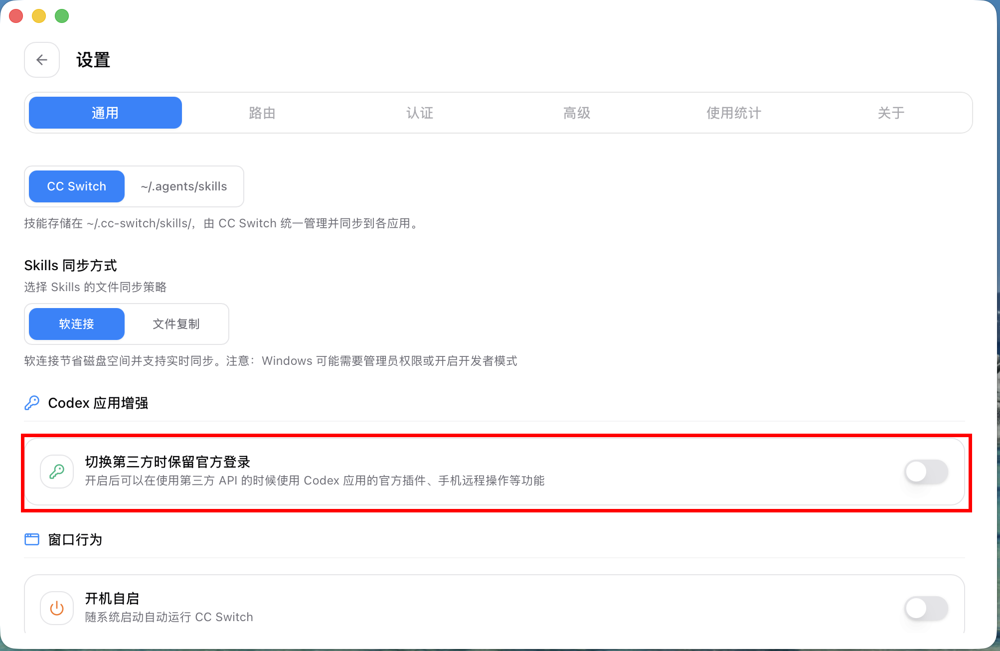

# サードパーティ API 利用時に Codex のリモート操作と公式プラグインを保持する: CC Switch 設定ガイド

> 対象バージョン: CC Switch v3.16.1 以降。本記事は現在のコード、ユーザーマニュアル、v3.16.1 Release Note をもとに整理しています。スクリーンショットは匿名化したサンプルデータを使用しており、実際の Access Token や API Key は含まれていません。

## このガイドで解決すること

Codex を使うとき、多くのユーザーには次の 2 つの要望があります。

1. DeepSeek、Kimi、GLM、MiniMax、SiliconFlow などのサードパーティ API、または中継サービス上の GPT モデルを使いたい。
2. Codex 公式アプリのモバイルリモート操作、公式プラグインなどの機能は残したい。

以前は、サードパーティプロバイダーへ切り替えると、旧動作ではサードパーティ API Key が Codex の `auth.json` に書き込まれ、元の公式 ChatGPT / Codex ログインキャッシュを上書きする可能性がありました。これによりサードパーティモデルは使えるものの、公式ログイン状態に依存する機能が消えてしまうことがありました。

v3.16.1 で追加された **Codex アプリ拡張** スイッチは、この矛盾を解決するためのものです。公式 Access Token は `auth.json` に残し、サードパーティプロバイダー情報は `config.toml` に書き込みます。これにより Codex App は引き続き公式アカウントでログインしていると認識しつつ、実際のモデルリクエストは CC Switch で現在選択されているサードパーティプロバイダーへ流れます。

この機能自体は v3.16.0 から存在し、当時はデフォルトで有効でした。ただし一部のユーザーから不要というフィードバックがあったため、v3.16.1 で明示的なスイッチになりました。

## まず結論

おすすめの手順は次のとおりです。

1. CC Switch の Codex パネルで `OpenAI Official` に切り替える。
2. Codex を起動し、公式 ChatGPT / Codex アカウントで一度ログインする。Free サブスクリプションでも構いません。
3. CC Switch に戻り、`設定 → 一般 → Codex アプリ拡張 → サードパーティ切替時に公式ログインを保持` をオンにする。
4. サードパーティ Codex プロバイダーを追加、または切り替える。
5. そのプロバイダーが DeepSeek / Kimi / MiniMax などの Chat Completions プロトコルの場合は、ローカルルーティングも有効化し、Codex のルーティングをオンにする。
6. Codex を再起動し、`config.toml` とモデルカタログを再読み込みさせる。



## 事前準備

次のものを用意してください。

- CC Switch v3.16.1 以降。
- インストール済みで起動できる Codex。app と CLI の両方を入れておくことをおすすめします。
- Codex にログインできる公式 ChatGPT / Codex アカウント。Free サブスクリプションで構いません。
- DeepSeek、Kimi、GLM、MiniMax、OpenRouter、SiliconFlow などのサードパーティ API Key。

`~/.codex/auth.json` の内容を手動でコピーしたり共有したりしないでください。このファイルには公式ログインキャッシュと Access Token が保存されており、機密情報です。

## Step 1: OpenAI Official に戻して公式ログインを完了する

CC Switch を開き、上部の `Codex` タブへ切り替えます。まず `OpenAI Official` プロバイダーを選択します。存在しない場合は、プリセットプロバイダーから追加して現在のプロバイダーにしてください。


次に Codex を起動します。CLI の起動がおすすめです。Codex の公式ログインフローに従い、ChatGPT / Codex アカウントでログインします。このアカウントは Free プランでも問題ありません。この構成では、主に Codex App が必要とする公式ログイン ID を保持する役割であり、サードパーティモデルの課金には使いません。

ログイン後、Codex は `~/.codex/auth.json` に公式ログインキャッシュを保存します。以降の重要なポイントは、サードパーティプロバイダー切り替えでこのファイルを上書きさせないことです。

## Step 2: Codex アプリ拡張を有効化する

CC Switch に戻り、次を開きます。

```text
設定 → 一般 → Codex アプリ拡張
```

次のスイッチをオンにします。

```text
サードパーティ切替時に公式ログインを保持
```

このスイッチはデフォルトでオフです。一部のユーザーはこの機能を必要としていないためです。「サードパーティ API + 公式リモート操作 / 公式プラグイン」を同時に使いたい場合だけ有効化してください。

有効化すると、バックエンドで Codex サードパーティプロバイダーを切り替えるときに config-only の書き込み経路が使われます。

- `auth.json`: 公式 ChatGPT / Codex ログインキャッシュを保持します。
- `config.toml`: 現在のサードパーティプロバイダーのモデル、endpoint、`model_provider`、provider-scoped `experimental_bearer_token` を書き込みます。

## Step 3: サードパーティ Codex プロバイダーを追加する

Codex パネルに戻り、右上のプラスボタンからプロバイダーを追加します。DeepSeek、Kimi、MiniMax、GLM、SiliconFlow などの内蔵プリセットを優先して使うのがおすすめです。

DeepSeek を例にすると、プリセットを選んだ後は API Key を入力するだけです。プリセットは base URL、デフォルトモデル、モデルマッピングテーブル、「ローカルルーティングが必要」設定を自動で構成します。


サードパーティプロバイダーが OpenAI Responses API をネイティブにサポートしている場合、たとえば GPT モデルを提供する中継サービスであれば、ローカルルーティングは不要なことがあります。
一方で DeepSeek / Kimi / MiniMax のように OpenAI Chat Completions だけをサポートする場合は、CC Switch が Codex の Responses リクエストを Chat Completions リクエストへ変換する必要があるため、ローカルルーティングを有効化してください。

## Step 4: 必要に応じてローカルルーティングと Codex ルーティングを有効化する

次を開きます。

```text
設定 → ルーティング → ローカルルーティング
```

次の 2 つを行います。

1. `ルーティング総スイッチ` をオンにし、ローカルサービスを起動する。デフォルトアドレスは通常 `127.0.0.1:15721` です。
2. `ルーティング有効` で `Codex` をオンにする。


ルーティング有効化後、Codex の live `config.toml` は一時的に CC Switch のローカルルートを指します。実際のサードパーティ API Key は CC Switch のプロバイダー設定内に残り、プロバイダー切り替え時に `config.toml` の `experimental_bearer_token` へ投影されます。

## Step 5: サードパーティプロバイダーへ切り替えて Codex を再起動する

Codex プロバイダー一覧に戻り、先ほど追加したサードパーティプロバイダーを有効化します。切り替え後は Codex の再起動をおすすめします。理由は 2 つあります。

- Codex は起動時に `config.toml` を読み込みます。
- Codex の `/model` メニューは通常、再起動後に `model_catalog_json` を再読み込みします。

再起動後、簡単に確認できます。

- Codex App ではアカウント情報が引き続き公式アカウントとして表示される。これは期待される動作です。
- CC Switch では現在の Codex プロバイダーがサードパーティプロバイダーになっている。
- ローカルルーティングを有効化している場合、リクエストログまたはルーティング統計で Codex リクエストがローカルルートを通っていることを確認できる。
- サードパーティプロバイダー側のダッシュボードや残高記録に実際のモデルリクエストが表示される。

## 仕組み

Codex の設定は主に 2 つのファイルに分かれています。

```text
~/.codex/auth.json
~/.codex/config.toml
```

この 2 つは役割が異なります。

- `auth.json` は公式 ChatGPT / Codex ログインキャッシュを保存します。Codex App が公式アカウント、リモート操作、公式プラグインを認識するために必要なログイン材料です。
- `config.toml` は現在のモデルプロバイダー、base URL、モデル、モデルカタログ、provider-scoped token などの実行時設定を保存します。

`サードパーティ切替時に公式ログインを保持` を有効化すると、CC Switch はサードパーティプロバイダー API Key をプロバイダー設定から取り出し、`config.toml` の現在の provider 配下へ書き込みます。

```toml
model_provider = "custom"

[model_providers.custom]
name = "DeepSeek"
base_url = "https://api.deepseek.com"
wire_api = "responses"
experimental_bearer_token = "sk-..."
```

同時に、`auth.json` は公式ログインキャッシュを保持したままです。そのため Codex App 側では公式アカウントを認識でき、モデルリクエストは `config.toml` の現在の provider と base URL に従ってサードパーティ API へ向かいます。

プロバイダーが Chat Completions プロトコルの場合、CC Switch のローカルルーティングがさらに変換層になります。

```text
Codex Responses リクエスト
        |
CC Switch ローカルルート
        |
サードパーティ Chat Completions API
        |
Codex Responses レスポンスへ変換
```

これにより、公式プラグイン / モバイルリモート操作を使い続けながら、モデル通信だけをサードパーティ API に切り替えられます。

## 理解しておくべき副作用

### Codex 内の表示アカウントは公式アカウントのまま

ここが最も誤解されやすい点です。この機能を有効化すると、Codex App は `auth.json` 内の公式ログイン状態を見るため、公式アカウント情報を表示し続けます。

ただし、これはモデルリクエストが公式 OpenAI に流れているという意味ではありません。実際の通信先は、CC Switch の現在の Codex プロバイダー、`config.toml`、ローカルルーティングログで判断してください。

### Codex のアカウント表示で課金先を判断しない

DeepSeek に切り替えた場合でも、Codex には公式アカウントが表示されます。しかしモデルリクエストは DeepSeek API へ送られます。課金、上限、エラーコード、データポリシーはサードパーティプロバイダー側の仕様として理解してください。具体的なリクエスト情報は使用量パネルで確認できます。

### モデルマッピングを変更したら Codex を再起動する

Codex のモデルカタログは起動時に読み込まれます。CC Switch が新しいモデルカタログを生成していても、実行中の Codex がホットロードするとは限りません。モデルマッピングを変更した後は Codex を再起動してください。

### スイッチをオフにすると旧動作に戻る

`サードパーティ切替時に公式ログインを保持` をオフにすると、サードパーティプロバイダー切り替えは旧バージョン互換の動作になり、`auth.json` が再度書き込まれる可能性があります。公式リモート操作と公式プラグインを長期的に保持したい場合は、このスイッチをオンのままにすることをおすすめします。

## よくある質問

**サードパーティ API に切り替えたのに、なぜ Codex はまだ公式アカウントを表示しますか？**

これは期待される動作です。公式アカウント情報は `auth.json` から取得され、実際のモデルプロバイダーは `config.toml` と CC Switch の現在のプロバイダーで決まります。

**Free サブスクリプションで本当に大丈夫ですか？**

大丈夫です。ここでの公式アカウントは、Codex App が必要とする公式ログイン状態を取得・保持するために使います。サードパーティモデルリクエストは、CC Switch に設定したサードパーティ API Key を使います。

**有効化しても公式プラグインやモバイルリモート操作が使えない場合は？**

まず `OpenAI Official` に戻し、Codex を再起動して一度公式ログインを完了してください。その後、CC Switch の `設定 → 一般 → Codex アプリ拡張 → サードパーティ切替時に公式ログインを保持` がオンになっていることを確認し、再度サードパーティプロバイダーへ切り替えてください。

**サードパーティリクエストが 404 になる、モデル一覧が違う、ストリーミング応答がおかしい場合は？**

そのプロバイダーが Chat Completions プロトコルの場合、プロバイダーフォームで `ローカルルーティングが必要` が有効になっていること、さらに `設定 → ルーティング` でルーティング総スイッチと Codex ルーティングがオンになっていることを確認してください。

**ローカルルーティング中に OpenAI Official へ戻せますか？**

おすすめしません。CC Switch は、ローカルルーティングで Codex を管理している間に公式プロバイダーへ切り替えることをできるだけ防ぎます。プロキシ経由で公式 API にアクセスすると、アカウントリスクが発生する可能性があるためです。公式ログインは `auth.json` を保持するために使い、モデル通信はサードパーティプロバイダーへ切り替えるのがおすすめです。

**なぜ手順がこんなに複雑なのですか？もっと簡単にできますか？**

Codex アプリ拡張やルーティング管理は、必要ないユーザーにとっては余計なトラブルになり得るため、常時有効ではなく明示的なスイッチになっています。

## 参考リンク

- [Codex DeepSeek ローカルルーティング実践ガイド](./codex-deepseek-routing-guide-ja.md)
- [Codex プロバイダーの追加: Chat Completions ルーティングとモデルマッピング](../user-manual/ja/2-providers/2.1-add.md)
- [ローカルプロキシサービス](../user-manual/ja/4-proxy/4.1-service.md)
- [ローカルルーティング](../user-manual/ja/4-proxy/4.2-routing.md)
- [CC Switch v3.16.1 Release Note](../release-notes/v3.16.1-ja.md)
